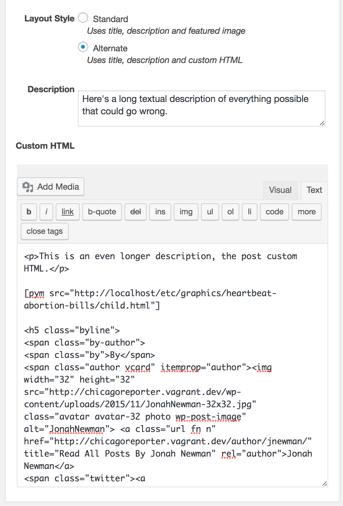

# Putting graphics in the series landing pages

Graphics will ideally be built in a separate page using [Pym.js]() and embedded using [the `[pym]` shortcode](https://wordpress.org/plugins/pym-shortcode/). Doing this allows you to separate the graphic's styles from the page's styles and rendering context.

With the Pym shortcode, embedding your interactive becomes as simple as:

```
[pym src="http://f.benlk.com/graphics/heartbeat-abortion-bills/child.html"]
```

To put this on a series landing page, choose the "Alternate" layout style and then put your graphic and additional content in the "Custom HTML" field:



For an example embedded graphic in a landing page, paste the following content into the "Custom HTML" editor:

```html
<p>This is an even longer description, the post custom HTML.</p>

[pym src="http://localhost/etc/graphics/heartbeat-abortion-bills/child.html"]

<h5 class="byline">
	<span class="by-author">
		<span class="by">By</span>
		<span class="author vcard" itemprop="author">
			
			<a class="url fn n" href="http://chicagoreporter.vagrant.dev/author/jnewman/" title="Read All Posts By Jonah Newman" rel="author">Jonah Newman</a>
			<span class="twitter"><a href="https://twitter.com/chicagoreporter"><i class="icon-twitter"></i></a></span>
		</span>
	</span>
	<span class="sep"> |</span>
	<time class="entry-date updated dtstamp pubdate" datetime="2016-09-20T17:09:24+00:00">September 20, 2016</time>
</h5>

<p>Loren ipsum dolor sit amet adipsicing conquiescant.<p>
```

The `<h5 class="byline">` element was copied from a post by that author, by right-clicking on the byline of the author on the post and choosing "Inspect Element" or similar. The following screenshot uses Chrome, but you can use other browsers' web inspection tools to find the `<h5 class="byline">`. Right-click on that element, and then choose Copy > Copy outerHTML. Some browsers may require you to choose "Edit as HTML" and then copy, or may allow you to press Control-C or Command-C to copy the element.


Then, go to the "Custom HTML" editor and paste.

This process can be done with any byline by the desired author or authors, or you can edit the pasted byline to point to a different author.
